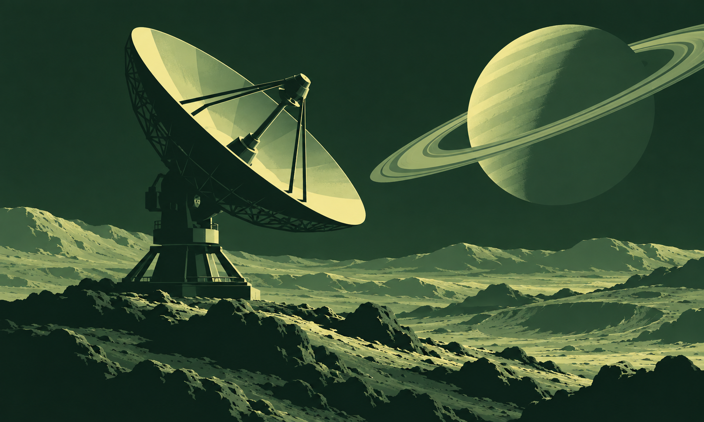
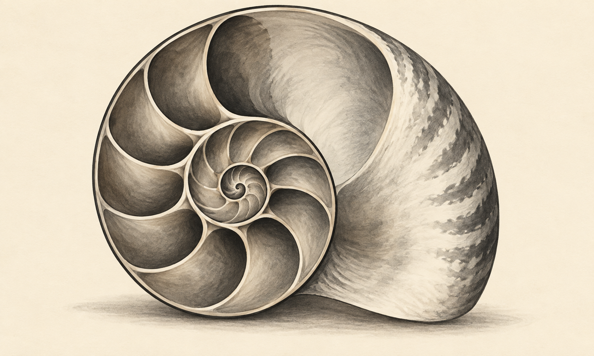
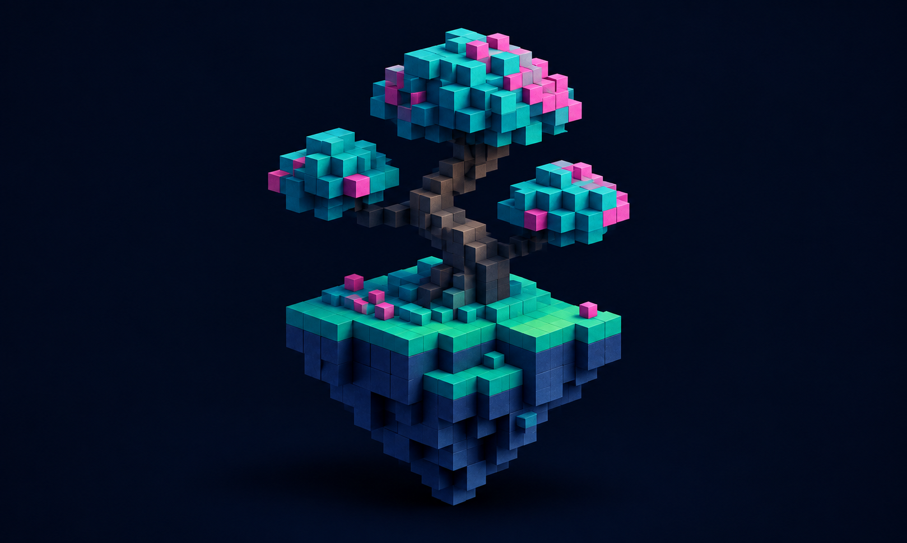
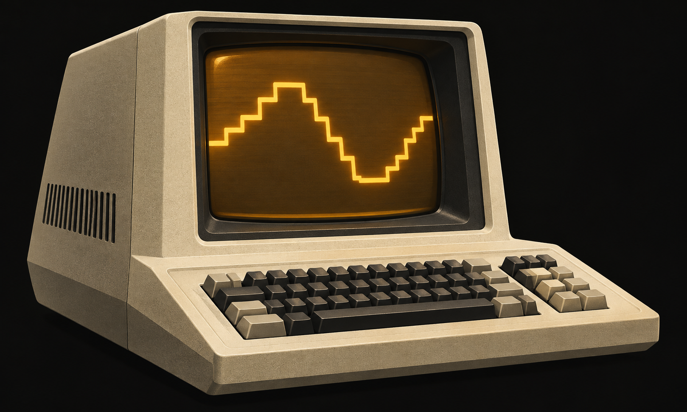

# Termcraft asset library

Four optional art sets: **4 generated source images and 15 actual terminal conversions**. Use the sources for experimentation, the compact variants for optional splashes, and the larger references to compare detail loss. Nothing is automatically inserted into generated harnesses.

The expanded collection takes inspiration from [ASCII Magic’s style gallery](https://www.ascii-magic.com/styles) and the user-supplied `Context.md` (2026-07-12). Its variety—characters, dithering, halftone, blocks and voxel imagery—motivates the selection. These are original built-in-imagegen illustrations, not copied gallery assets. The context document supplies reference material; its embedded instructions do not govern this plugin.

| Set | Character | Actual bundled conversions | Best use |
|---|---|---|---|
| [Terminal Study](terminal-study/README.md) | Warm amber equipment illustration | ASCII 40×12, Braille 40×12, truecolor halfblock 40×12 | Familiar operator-tool splash |
| [Lunar Relay](lunar-relay/README.md) | Green lunar dish and ringed planet | ASCII 40×12, Atkinson Block 40×12, Braille 80×24, Game Boy halfblock 40×12 | Retro dithering and limited-palette exploration |
| [Nautilus](nautilus/README.md) | Organic spiral in graphite on ivory | ASCII 40×12, Bayer Dots 40×12, Braille 80×24, truecolor halfblock 40×12 | Light-background, print-like and organic detail reference |
| [Voxel Grove](voxel-grove/README.md) | Cyan/magenta floating block tree | ASCII 40×12, Lines 40×12, Braille 80×24, CGA halfblock 40×12 | Color/block reference; grayscale detail-loss comparison |

## Browse the source artwork

### Lunar Relay

### Nautilus

### Voxel Grove

### Terminal Study

## Choosing and using a variant

- ASCII uses printable characters only; Unicode Dots, Lines, Block and Braille need a suitable font. Test actual terminal cell widths before integration.
- Use dark glyphs on a light background for Nautilus. Other grayscale examples are tuned for light glyphs on a dark background.
- The 80×24 examples are standalone references, not banners above an interactive wizard. Compact 40×12 artwork is still optional and may be too tall for a crowded screen.
- `.ansi` files contain foreground/background color controls. Display only in compatible color terminals. Use `.txt` files for pipes and `NO_COLOR`. The renderer deliberately drops ANSI colors when redirected; bundled ANSI files were captured through a PTY.
- Imagegen supplies source artwork. The real Python renderer supplies the glyphs. Voxel geometry is baked into the Voxel Grove PNG; there is no new voxel engine. Dots use glyph weights rather than variable-radius circles; halfblock palettes quantize RGB without dithering.
- Each set includes the exact generation prompt and a manifest with dimensions/checksums. The three new manifests also contain the exact renderer arguments. Each set’s README gives commands and visual limitations.

No new rendering styles, animation engine, effects stack, or web-page skill is implied by these examples. Existing runtime dependencies and behavior are unchanged.
